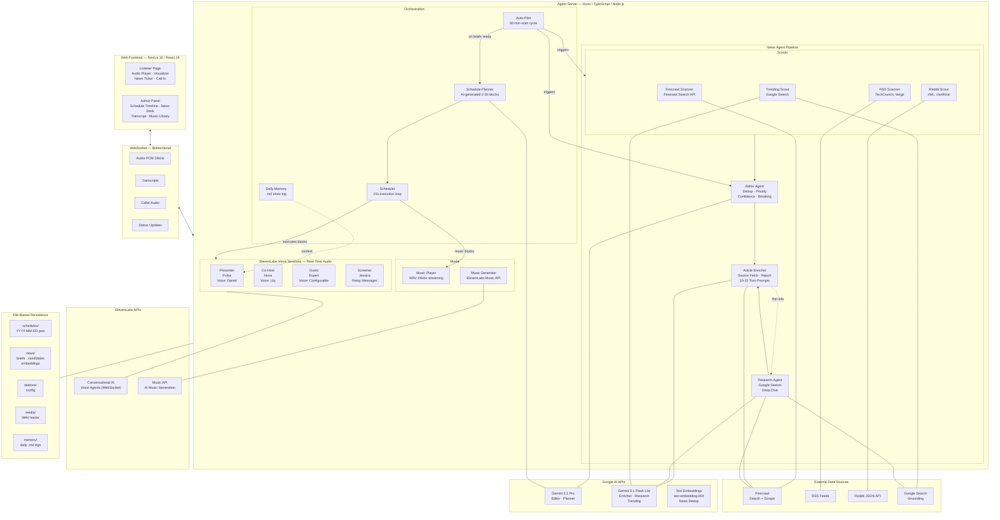

```mermaid
flowchart TB
    subgraph FRONTEND["Web Frontend — Next.js 16 / React 19"]
        direction LR
        LP["Listener Page\nAudio Player · Visualizer\nNews Ticker · Call-In"]
        AP["Admin Panel\nSchedule Timeline · News Desk\nTranscript · Music Library"]
    end

    subgraph WS["WebSocket — Bidirectional"]
        direction LR
        W1["Audio PCM 24kHz"]
        W2["Transcripts"]
        W3["Caller Audio"]
        W4["Status Updates"]
    end

    subgraph BACKEND["Agent Server — Hono / TypeScript / Node.js"]
        direction TB

        subgraph LIVE["ElevenLabs Voice Sessions — Real-Time Audio"]
            direction LR
            PULSE["Presenter\nPulse\nVoice: Daniel"]
            NOVA["Co-Host\nNova\nVoice: Lily"]
            GUEST["Guest\nExpert\nVoice: Configurable"]
            SCREEN["Screener\nJessica\nRelay Messages"]
        end

        subgraph AGENTS["News Agent Pipeline"]
            direction LR
            subgraph SCOUTS["Scouts"]
                FIRECRAWL_SCAN["Firecrawl Scanner\nFirecrawl Search API"]
                RSS["RSS Scanner\nTechCrunch, Verge"]
                REDDIT["Reddit Scout\nr/ML, r/artificial"]
                TREND["Trending Scout\nGoogle Search"]
            end
            EDITOR["Editor Agent\nDedup · Priority\nConfidence · Breaking"]
            ENRICH["Article Enricher\nSource Fetch · Report\n10-15 Turn Prompts"]
            RESEARCH["Research Agent\nGoogle Search\nDeep Dive"]
        end

        subgraph ORCH["Orchestration"]
            direction LR
            AUTOPILOT["Auto-Pilot\n60-min scan cycle"]
            PLANNER["Schedule Planner\nAI-generated 2-3h blocks"]
            SCHED["Scheduler\n15s execution loop"]
            MEMORY["Daily Memory\n.md show log"]
        end

        subgraph MEDIA["Media"]
            direction LR
            MPLAYER["Music Player\nWAV 24kHz streaming"]
            MGEN["Music Generator\nElevenLabs Music API"]
        end
    end

    subgraph GOOGLE["Google AI APIs"]
        direction LR
        GPRO["Gemini 3.1 Pro\nEditor · Planner"]
        GFLASH["Gemini 3.1 Flash Lite\nEnricher · Research\nTrending"]
        GEMBED["Text Embeddings\ntext-embedding-004\nNews Dedup"]
    end

    subgraph ELEVENLABS["ElevenLabs APIs"]
        direction LR
        ELVOICE["Conversational AI\nVoice Agents (WebSocket)"]
        ELMUSIC["Music API\nAI Music Generation"]
    end

    subgraph EXTERNAL["External Data Sources"]
        direction LR
        FIRECRAWLAPI["Firecrawl\nSearch + Scrape"]
        RSSF["RSS Feeds"]
        REDDITAPI["Reddit JSON API"]
        GSEARCH["Google Search\nGrounding"]
    end

    subgraph STORAGE["File-Based Persistence"]
        direction LR
        S1["schedules/\nYYYY-MM-DD.json"]
        S2["news/\nbriefs · candidates\nembeddings"]
        S3["stations/\nconfig"]
        S4["media/\nWAV tracks"]
        S5["memory/\ndaily .md logs"]
    end

    FRONTEND <--> WS
    WS <--> BACKEND

    LIVE --- ELVOICE
    SCOUTS --> EDITOR --> ENRICH
    ENRICH -.->|thin info| RESEARCH
    RESEARCH --> ENRICH

    AUTOPILOT -->|triggers| SCOUTS
    AUTOPILOT -->|triggers| EDITOR
    AUTOPILOT -->|on briefs ready| PLANNER
    PLANNER --> SCHED
    SCHED -->|executes blocks| LIVE
    SCHED -->|music blocks| MPLAYER
    MEMORY -.->|context| PULSE

    FIRECRAWL_SCAN --- FIRECRAWLAPI
    RSS --- RSSF
    REDDIT --- REDDITAPI
    TREND --- GSEARCH
    RESEARCH --- GSEARCH
    ENRICH --- FIRECRAWLAPI
    RESEARCH --- FIRECRAWLAPI

    EDITOR --- GPRO
    ENRICH --- GFLASH
    RESEARCH --- GFLASH
    TREND --- GFLASH
    PLANNER --- GPRO

    MGEN --- ELMUSIC

    BACKEND --- STORAGE
```
